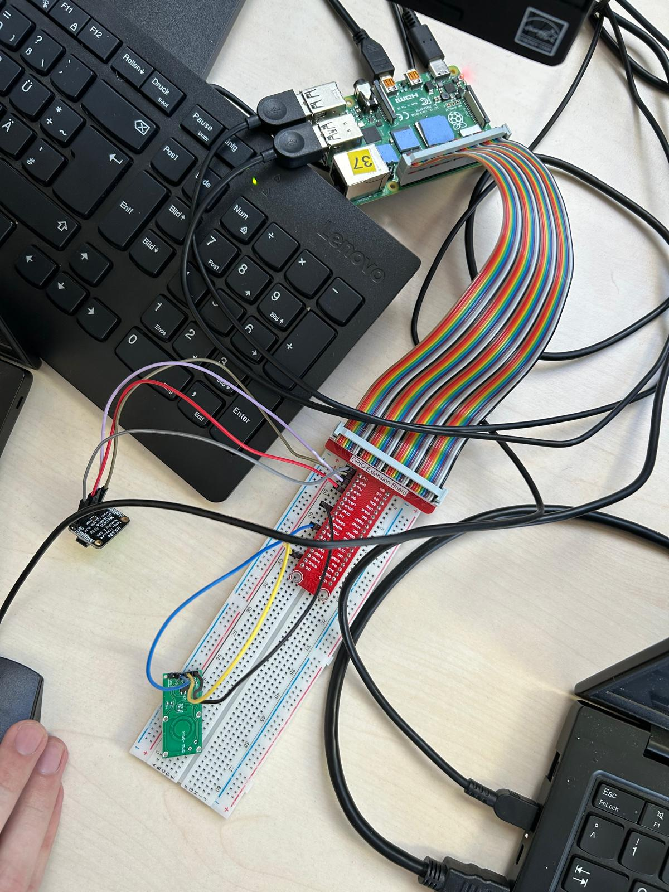
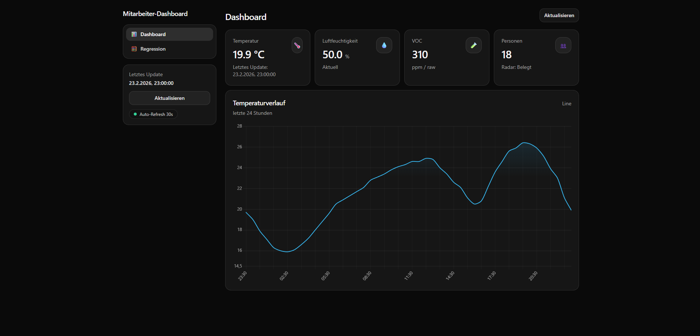
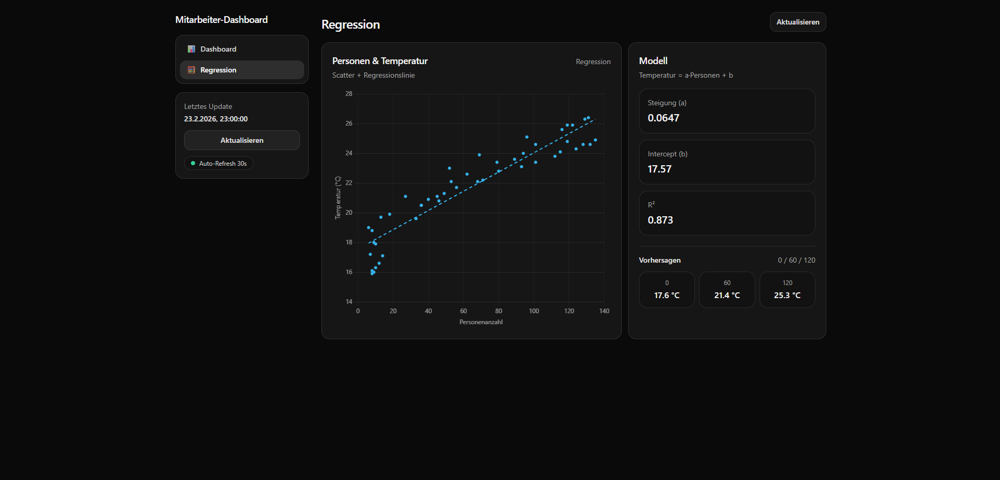

# Project Asia Restaurant 🍜🌡️

Schulprojekt: Sensor-/IoT-Dashboard für ein (simuliertes) Asia-Restaurant – mit Messwerterfassung, Datenbank, Web-GUI und einfacher Auswertung (lineare Regression).

---

## Inhalt
- [Projektidee](#projektidee)
- [Features](#features)
- [Technologien](#technologien)
- [Architektur (High Level)](#architektur-high-level)
- [Setup & Start (Docker)](#setup--start-docker)
- [Konfiguration (.env)](#konfiguration-env)
- [Benutzung](#benutzung)
- [Ordner- & Dateistruktur](#ordner--dateistruktur)
- [Bilder / Dokumentation](#bilder--dokumentation)
- [Troubleshooting](#troubleshooting)
- [Autoren](#autoren)

---

## Projektidee
In einem (simulierten) Asia-Restaurant werden Umwelt- und Belegungsdaten erfasst (z. B. Temperatur, Luftfeuchtigkeit, VOC und Personen/Radar).  
Diese Messwerte werden gespeichert und über ein Web-Dashboard visualisiert.

Zusätzlich wird eine einfache **lineare Regression** berechnet (z. B. Zusammenhang „Personen ↔ Temperatur“) und als Diagramm + Kennzahlen (Steigung, Intercept, R²) dargestellt.

---

## Features
- Web-Dashboard (Flask) mit Kacheln & Diagrammen (z. B. Verlauf der letzten 24h)
- API-Endpoint liefert JSON für das Dashboard (z. B. aktuelle Werte, Verlauf, Regression)
- MariaDB zur Speicherung von Messwerten (über ORM)
- Celery Worker + Celery Beat für periodische Jobs (z. B. Daten holen/aufbereiten)
- Nginx als Reverse Proxy vor Flask
- Optional: phpMyAdmin zur Ansicht/Debugging der Datenbank

---

## Technologien

### Backend
- Python (Container)
- Flask (Webserver)
- SQLAlchemy (ORM) + Migrationen (z. B. Flask-Migrate)
- Celery (Jobs/Queue)
- Redis (Broker/Backend für Celery)

### Infrastruktur / Datenbank
- MariaDB
- Nginx (Reverse Proxy)
- Docker + Docker Compose

### Datenanalyse
- Lineare Regression (z. B. mit SciPy)

### Hardware/Sensorik (je nach Aufbau)
- BME680 (Temperatur/Luftfeuchte/VOC) über I2C (z. B. Raspberry Pi / Linux)
- Optional: Radar/Belegungssensor oder simulierte Personenwerte

---

## Architektur (High Level)
Docker Compose startet mehrere Services:
- `mariadb` (persistente DB)
- `redis` (Celery Broker/Backend)
- `flask` (Web-App)
- `celery_worker` (führt Jobs aus)
- `celery_beat` (plant Jobs)
- `nginx` (Proxy)
- `phpmyadmin` (optional)

---

## Setup & Start (Docker)

### Voraussetzungen
- Docker installiert
- Docker Compose installiert
- UV installiert

### 1) Repo klonen
```bash
git clone https://github.com/git-marius/project-asia-restaurant.git
cd project-asia-restaurant
```

### 2) `.env` anlegen
```bash
cp .env.example .env
```

### 3) Virtual Environment aufsetzen und installieren
```bash
cd python
uv venv
uv sync
```

### 4) Container starten
```bash
docker compose up --build
```

Danach erreichbar (je nach Ports aus `.env`):
- Web-App: `http://localhost:<WEB_PORT>` (oft `http://localhost:80`)
- phpMyAdmin (optional): `http://localhost:<PHPMYADMIN_PORT>` (oft `http://localhost:8081`)

---

## Konfiguration (.env)
Die wichtigsten Variablen stehen in `.env.example`. Typisch sind:
- `PROJECT_NAME` – Prefix/Name für Container
- `WEB_PORT` – Port für Nginx (extern)
- `FLASK_PORT` – interner Flask Port
- `MYSQL_HOST`, `MYSQL_PORT`, `MYSQL_DATABASE`, `MYSQL_USER`, `MYSQL_PASSWORD` – MariaDB Zugangsdaten
- `PHPMYADMIN_PORT` – Port für phpMyAdmin

> Hinweis: Wenn Ports bereits belegt sind, ändere `WEB_PORT` oder `PHPMYADMIN_PORT`.

---

## Benutzung

### Wichtig: Migrationen ausführen, bevor du seedest
Bevor Demo-Daten geseedet werden, muss die Datenbank auf dem **aktuellen Stand** sein.  
Führe daher **zuerst** das Upgrade der Migrationen aus:

```bash
docker compose exec flask uv run flask db upgrade
```

Danach kannst du seeden.

### Datenbank seeden (Demo-Daten)
Für eine schnelle Demo kann die Datenbank mit Beispiel-Messwerten befüllt werden.

> Hinweis: Das Seeding **fügt** Datensätze hinzu (es löscht keine bestehenden). Bei erneutem Ausführen entstehen ggf. Duplikate.

```bash
docker compose exec flask uv run flask seed
```

Danach das Dashboard neu laden – die Charts/Regression sollten Daten anzeigen.

### Web-Dashboard
- Öffne die Startseite im Browser (Root `/`) um das Dashboard zu sehen.

### API
- `GET /api/dashboard` liefert typischerweise:
  - aktuelle Werte (z. B. Temperatur, Feuchte, VOC, Personen)
  - Verlaufspunkte (z. B. letzte 24h)
  - Scatterdaten + Regression (Steigung, Achsenabschnitt, R²)
  - ggf. einfache Vorhersagen (z. B. Temperatur bei 0/60/120 Personen)

---

## Ordner- & Dateistruktur
> Kurzüberblick (kann sich je nach Projektstand ändern)

```text
project-asia-restaurant/
├─ docker-compose.yml
├─ .env.example
├─ nginx/
│  └─ nginx.conf
└─ python/
   ├─ Dockerfile
   ├─ pyproject.toml
   ├─ uv.lock
   ├─ wsgi.py
   └─ app/
      ├─ __init__.py
      ├─ config.py
      ├─ routes.py
      ├─ celery_app.py
      ├─ extensions/
      │  ├─ __init__.py
      │  ├─ db.py
      │  └─ migrate.py
      ├─ models/
      │  ├─ __init__.py
      │  ├─ measurements.py
      │  └─ repositories.py
      └─ templates/
         ├─ base.html
         └─ dashboard.html
```

**Wichtige Dateien**
- `docker-compose.yml`: definiert alle Services (DB, Redis, Flask, Celery, Nginx, phpMyAdmin)
- `nginx/nginx.conf`: Reverse-Proxy-Konfiguration
- `python/Dockerfile`: baut das Python-Image
- `python/app/routes.py`: Routen für Dashboard & API (inkl. Regression)
- `python/app/models/*`: Datenmodelle / Tabellen
- `python/app/templates/*`: HTML Templates

---

## Bilder / Dokumentation

### Schaltung / Verdrahtung



### GUI / Dashboard




---

## Troubleshooting
- **Ports belegt**: `WEB_PORT` oder `PHPMYADMIN_PORT` in `.env` ändern und neu starten.
- **DB-Probleme**: `MYSQL_*` Werte prüfen und schauen ob `mariadb` läuft (`docker compose ps`).
- **Celery läuft nicht**: Redis-Service prüfen (Celery nutzt Redis als Broker/Backend).
- **Build/Dependencies**: `docker compose build --no-cache` probieren.

---

## Autoren
- Bogdan Varareanu
- Marius Güldner
